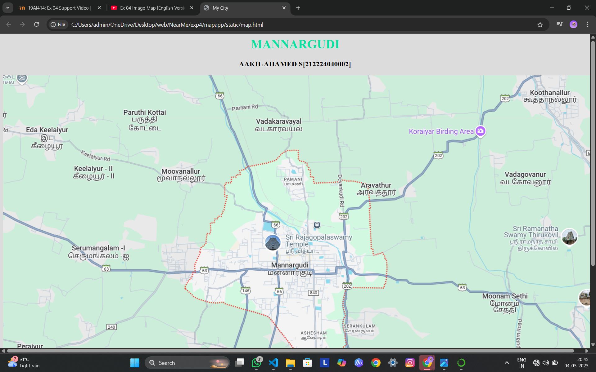
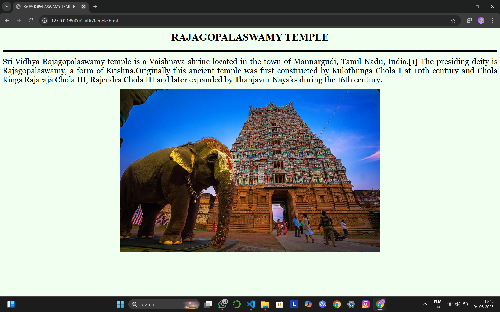
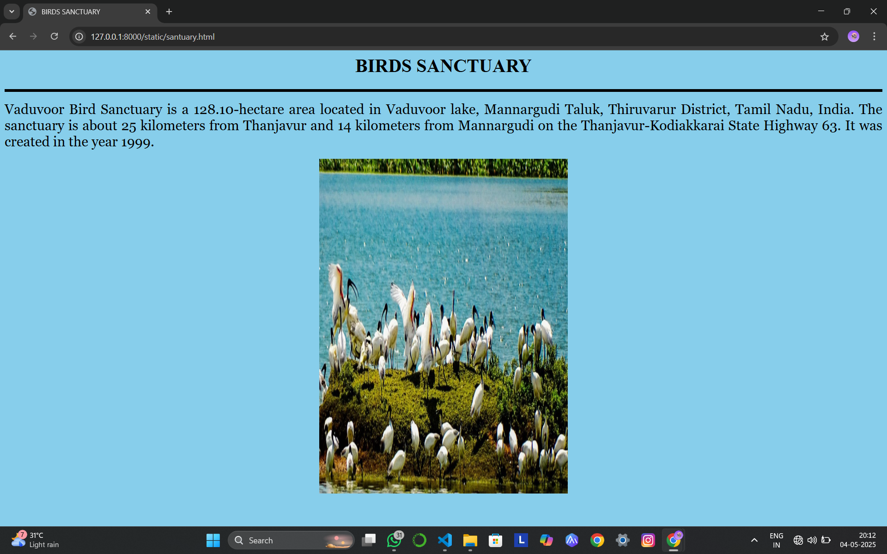
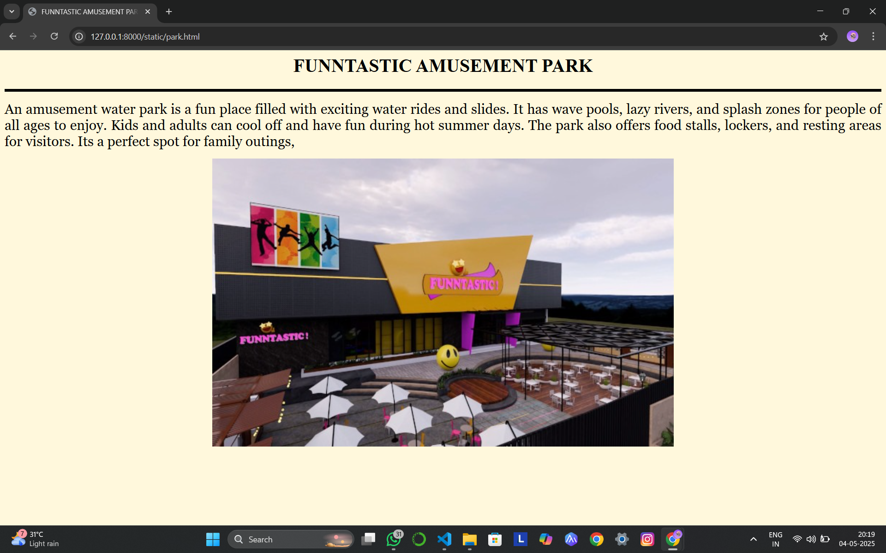
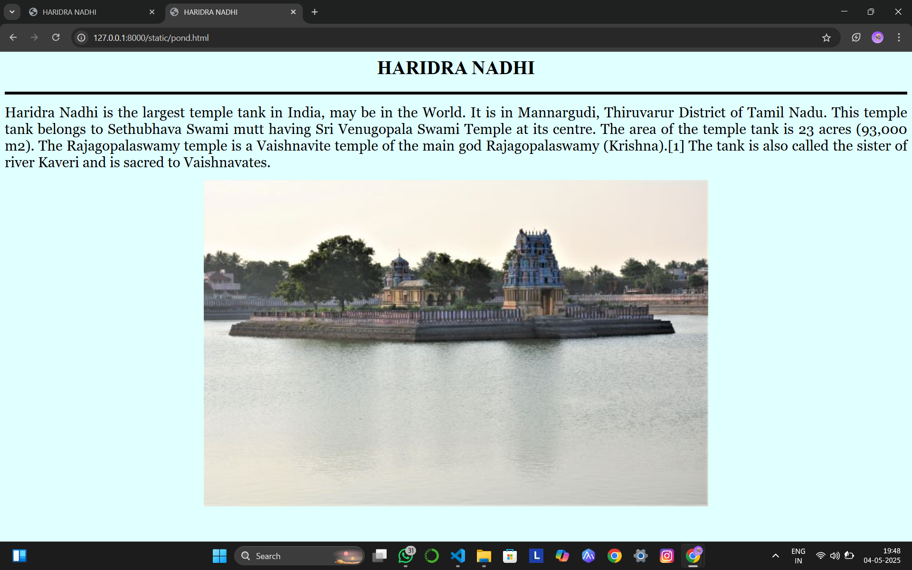

# Ex04 Places Around Me
## Date: 

## AIM
To develop a website to display details about the places around my house.

## DESIGN STEPS

### STEP 1
Create a Django admin interface.

### STEP 2
Download your city map from Google.

### STEP 3
Using ```<map>``` tag name the map.

### STEP 4
Create clickable regions in the image using ```<area>``` tag.

### STEP 5
Write HTML programs for all the regions identified.

### STEP 6
Execute the programs and publish them.

## CODE
```
map.html
<html>
    <head>
        <title>
            My City
        </title>
    </head>
    <body bgcolor="#DCDCDC">
        <h1 align="center">
            <font color="magenda"><b>MANNARGUDI</b></font>
        </h1>
        <h3 align="center">
            <font color="black"><b>AAKIL AHAMED S</b>[212224040002]</b></font>
        </h3>
        <center>
<!-- Image Map Generated by http://www.image-map.net/ -->


<map name="image-map">
    <area target="" alt="temple" title="temple" href="temple.html" coords="792,457,662,403" shape="rect">
    <area target="" alt="water park" title="water park" href="park.html" coords="794,787,905,846" shape="rect">
    <area target="" alt="temple tank" title="temple tank" href="pond.html" coords="655,367,711,407,787,359,125,817" shape="rect">
    <area target="" alt="santuary" title="santuary" href="santuary.html" coords="4,352,60,390" shape="rect">
</map>
        </center>
    </body>

</html>

temple.html
<html>
    <head>
        <title>RAJAGOPALASWAMY TEMPLE</title>
    </head>
   
    <body bgcolor="#F0FFF0">
        <h1 align="center">
        <font color="black"><b>RAJAGOPALASWAMY TEMPLE</b></font>
        </h1>
        
       
        <hr size="5" color="black">
        <p align="justify">
        <font face="Georgia" size="5">
            Sri Vidhya Rajagopalaswamy temple is a Vaishnava shrine located in the town of Mannargudi, Tamil Nadu, India.[1] The presiding deity is Rajagopalaswamy, a form of Krishna.Originally this ancient temple was first constructed by Kulothunga Chola I at 10th century and Chola Kings Rajaraja Chola III, Rajendra Chola III and later expanded by Thanjavur Nayaks during the 16th century. 
        </font>
        <center> 
            
        </center>
        </p>
    </body>
</html>

santuary.html
<html>
    <head>
        <title>BIRDS SANCTUARY</title>
    </head>
   
    <body bgcolor="skyblue">
        <h1 align="center">
        <font color="black"><b>BIRDS SANCTUARY</b></font>
        </h1>
        
       
        <hr size="5" color="black">
        <p align="justify">
        <font face="Georgia" size="5">
            Vaduvoor Bird Sanctuary is a 128.10-hectare area located in Vaduvoor lake, Mannargudi Taluk, Thiruvarur District, Tamil Nadu, India. The sanctuary is about 25 kilometers from Thanjavur and 14 kilometers from Mannargudi on the Thanjavur-Kodiakkarai State Highway 63. It was created in the year 1999.
        </font>
        <center> 
            
        </center>
        </p>
    </body>
</html>

park.html
<html>
    <head>
        <title>FUNNTASTIC AMUSEMENT PARK</title>
    </head>
   
    <body bgcolor="#FFF8DC">
        <h1 align="center">
        <font color="black"><b>FUNNTASTIC AMUSEMENT PARK</b></font>
        </h1>
        
       
        <hr size="5" color="black">
        <p align="justify">
        <font face="Georgia" size="5">
            An amusement water park is a fun place filled with exciting water rides and slides.
            It has wave pools, lazy rivers, and splash zones for people of all ages to enjoy.
            Kids and adults can cool off and have fun during hot summer days.
            The park also offers food stalls, lockers, and resting areas for visitors.
            Its a perfect spot for family outings,
        </font>
        <center> 
            
        </center>
        </p>
    </body>
</html>

pond.html
<html>
    <head>
        <title>HARIDRA NADHI</title>
    </head>
   
    <body bgcolor="#E0FFFF">
        <h1 align="center">
        <font color="black"><b>HARIDRA NADHI</b></font>
        </h1>
       
        <hr size="5" color="black">
        <p align="justify">
        <font face="Georgia" size="5">
            Haridra Nadhi is the largest temple tank in India, may be in the World. It is in Mannargudi, Thiruvarur District of Tamil Nadu. This temple tank belongs to Sethubhava Swami mutt having Sri Venugopala Swami Temple at its centre. The area of the temple tank is 23 acres (93,000 m2). The Rajagopalaswamy temple is a Vaishnavite temple of the main god Rajagopalaswamy (Krishna).[1] The tank is also called the sister of river Kaveri and is sacred to Vaishnavates.
        </font>
        <center> 
            
        </center>
        </p>
    </body>
</html>
```

## OUTPUT







## RESULT
The program for implementing image maps using HTML is executed successfully.
